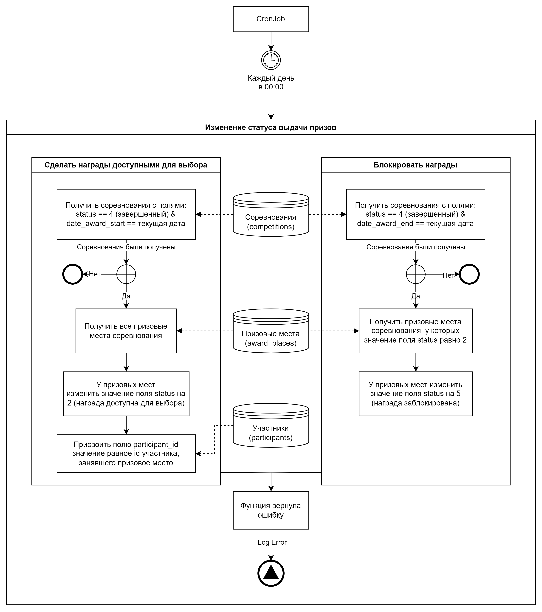

# Пример страницы

Это пример страницы

| Название | Тип    | Описание |
| -------- | ------ | -------- |
| id       | int    | id       |
| name     | string | Название |

<figure><figcaption>
Изменение статуса выдачи призов
</figcaption></figure>

